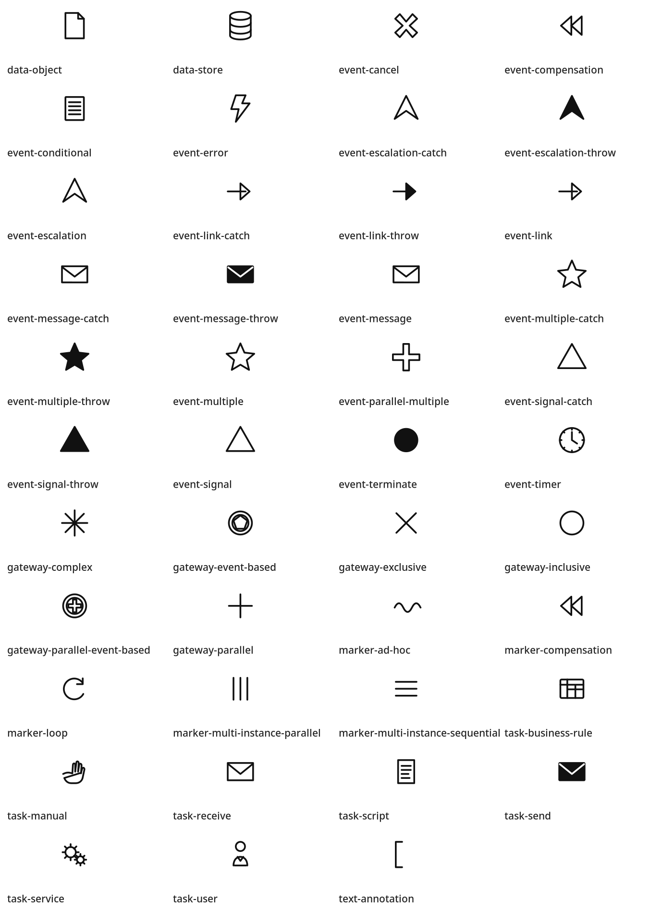

# d2-bpmn

[D2](https://d2lang.com/) で BPMN 風の業務プロセス図を描くためのテンプレート・クラス定義集と、
AI エージェント用スキル (opencode) のセットです。



## 特徴

- **BPMN 要素を D2 クラスで定義**: イベント / ゲートウェイ / タスク / データ要素 / フローを
  `class:` 指定だけで使える (アイコン SVG 付き 60 種以上)
- **プール / レーン / タスクは D2 テンプレート** (部分 import) で提供
- **色トークンの集約**: 配色は `lib/bpmn.d2` の `vars.bpmn` を変更するだけで全体に反映
- **opencode スキル同梱**: `bpmn-diagram` (作図) / `bpmn-layout` (レイアウト調整) の
  手順・知見がエージェントに継承され、AI 支援下の作図が可能

## 前提ツール

| ツール | 用途 |
|---|---|
| [d2](https://d2lang.com/) (v0.8+) | コンパイル・整形・検証。レイアウトは `--layout=tala` を使用 (要ライセンス) |
| VS Code 拡張 `terrastruct.d2` | エディタ内プレビュー・補完 |
| GNU make | 整形・検証・ビルドの統一コマンド |

## クイックスタート

```bash
# 1. 新規図を作業フォルダへコピー
cp templates/process.d2 works/my-process.d2

# 2. 編集 (クラス・テンプレートの詳細は .opencode/skills/bpmn-diagram/SKILL.md)

# 3. 整形 → 検証 → ビルド
make fmt
make check
make build
open out/my-process.svg
```

図の最小構成:

```d2
...@../lib/bpmn

開始.class: start-none-event
開始: 開始
TSK-000001: @../lib/components/task.task
TSK-000001.desc.label: "作業をする"
終了.class: end-none-event
終了: 完了

開始 -> TSK-000001 -> 終了
```

## ディレクトリ構成

```
lib/bpmn.d2                  共通ライブラリエントリポイント (色トークン + クラス再公開)
lib/components/              要素別定義 (task / container / event / gateway / data / stroke)
lib/icons/                   BPMN マーカー SVG アイコン
templates/process.d2         新規図作成用テンプレート
examples/                    利用例・動作確認用の図
works/                       作業者が作成する図の作業フォルダ
scripts/                     補助スクリプト (座標一括設定・単一ファイルレンダリング)
.opencode/skills/            opencode 用スキル (bpmn-diagram / bpmn-layout)
out/                         ビルド成果物の出力先 (管理対象外)
```

## コマンド

| コマンド | 内容 |
|---|---|
| `make fmt` | 全 `.d2` を整形 |
| `make check` | 全 `.d2` の構文検証 (`d2 validate`) |
| `make build` | templates / examples / works を `out/` に SVG 出力 |
| `make buildpng` | 同上を PNG 出力 |
| `make watch FILE=works/foo.d2` | ライブプレビュー (ポート 39981 固定) |
| `make clean` | `out/` を削除 |

## 運用フロー (要素 ID 管理)

`works/` の実例のように、`component-list.md` で
アクター (POL)・ユースケース (UC)・タスク (TSK) などの要素 ID 台帳を管理し、
図ファイルではキー = 要素 ID (例: `TSK-000001`) として参照する運用を想定しています。
実例: `works/component-list.md` / `works/UC-01001.d2`

## AI 支援での作図 (opencode)

本リポジトリを opencode で開くと、以下のスキルが参照されます。

| スキル | 内容 |
|---|---|
| `bpmn-diagram` | 要素カタログ、作図ワークフロー、接続・記述規約 |
| `bpmn-layout` | レイアウト調整手順、tala の経路挙動の知見、座標編集スクリプト |

## ライセンス

- 本リポジトリのソース (D2 定義・スクリプト・スキル・ドキュメント): [MIT License](LICENSE)
- `fonts/` 配下の IPA フォント: [IPA Font License v1.0](LICENSE.ipafont) (無改変の再配布を許可)
